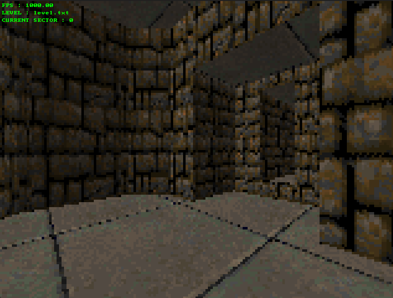
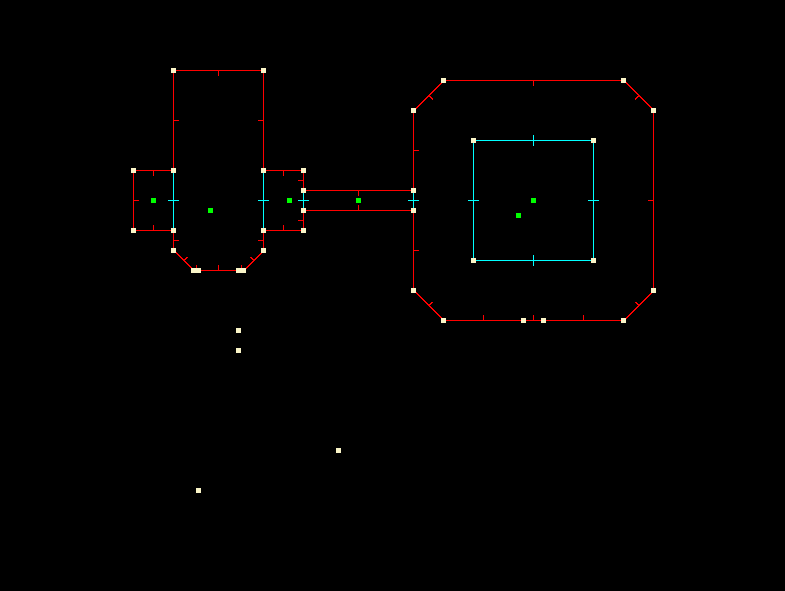

# Doom-like Software Renderer

Here's my doom style software raycasting renderer written in C23 with SDL3.
It is capable of parsing and rendering levels composed of sectors with different floor and ceiling heights as well as billboarded sprites.
It also supports textures for walls, floors and ceilings.

## Features

- Level parsing and rendering
- Sector and portal based rendering with floor and ceiling heights
- Textured walls, floors and ceilings
- Billboard sprites rendering (with BILLBOARD, SPRITE and TRANSFORM components)
- Level hot reloading (by pressing R on the keyboard) (Broken right now)
- 3D and level visualization modes (press SPACE to switch between them)
- ECS architecture with entities and components creation in level file.
- Frame-budget conscious architecture using custom allocators.
- Baked lighting (press L to generate lightmaps)

## Levels

The level format is similar in some ways to the wavefront obj format :  
you first define the vertices with lines starting with 'v' followed by 2d coordinates, 
you then define the segments with lines starting with 'w' followed by a sector index starting at 1 if its a portal, 0 if not, 2 vertex indices and then texture informations,  
and finally you define the sectors with lines starting with 's' followed by the first segment's index, the number of segments, the heights of the floor and ceiling and texture informations.  

You can also define entities with lines starting with 'e' (what follows is ignored by the parser for now),
and you can add components to those entities with lines starting with 'c', followed by the entity index , the component type and the component's parameters.

A line starting with '#' is a comment. 
you can find an exemple level [here](demo_files/level.txt).

## Controls

SPACE to switch between editor and game modes, R to reload the level, and L to generate lightmaps.

### Level Preview

The arrow keys to move around.

### In-game

WASD to move, the mouse to look around.

## Build

The project uses CMake and is only compatible with GCC and Clang compilers.

SDL and SDL_image are included in the project as git submodules and will compile with the app for your platform.

## Plans for the future

- Add a fully working asset manager
- Add a level editor and more debug tools using Nuklear.
- Add systems and multithreaded jobs to the ECS.
- Write a custom rendering backend with OpenGL and get rid of SDL3

## Toolset

- CMake
- C23
- SDL3
- SDL3_image
- Nuklear
- [HClib](https://github.com/Halchimer/hc) - My custom C utility library
- [HCGmath](https://github.com/Halchimer/hcgmath) - My custom C SIMD vector math library for GCC and Clang.
